<!-- page_number: true -->

# deck.glを利用した、マップ上に移動体の情報を表示するライブラリの開発について

<style>
.slide pre code {
    font-size: 20px !important;
}
</style>

---


# 目次

1. 開発中のライブラリ（Harmoware-VIS）の紹介
2. deck.glの紹介
3. Harmoware-VISを使ってみる

---

# 1. 開発中のライブラリ（Harmoware-VIS）の紹介

JavaScriptライブラリである、React Redux deck.glを使って、WebGL上で移動体の情報可視化や管理などを行うためのライブラリーで、主に名古屋大学河口研究室が中心になって開発しています。
先ほど紹介した以下のライブラリに依存しています。

- react-map-gl
- luma.gl
- deck.gl

---

# 1. 開発中のライブラリ（Harmoware-VIS）の紹介

[https://github.com/Harmoware/Harmoware-VIS](https://github.com/Harmoware/Harmoware-VIS)

---
# 1. 開発中のライブラリ（Harmoware-VIS）の紹介

`Harmowrare-VIS`の実行画面

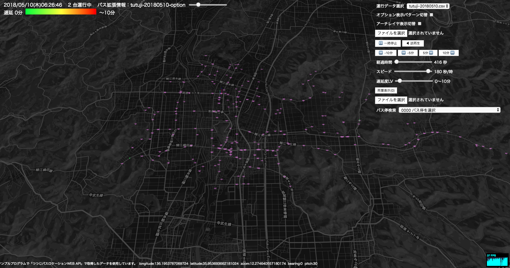

---

# 1. 開発中のライブラリ（Harmoware-VIS）の紹介

事前知識を勉強できるチュートリアルページ

Node.js, npm, Webpack, Babel, React, Reduxの説明が詳しく書かれている

[https://github.com/Harmoware/Harmoware-VIS-Tutorial](https://github.com/Harmoware/Harmoware-VIS-Tutorial)


---
# 2. deck.glの紹介

---
# deck.glの紹介

WebGLベースの地理情報視覚化用のコンポーネント集
Reactとの連携が可能。

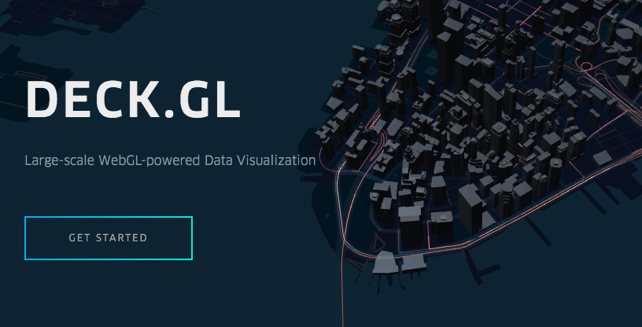

---
# deck.gl 導入方法

以下の3つのライブラリーが必要

- react-map-gl
- luma.gl
- deck.gl

```sh
npm install deck.gl luma.gl react-map-gl --save
```

---
# react-map-gl

OpenStreetMapのライブラリであるmap-glをReactベースで使えるようにしたライブラリ。
Uber社が開発
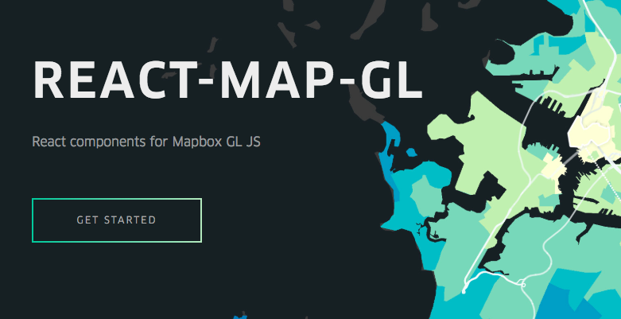

---
# luma.gl

Uber社が開発した、WebGL用データビジュアライゼーションライブラリー。
これを利用して、deck.glが動作します。


---

記述例

```js
import DeckGL, {ArcLayer} from 'deck.gl';

const flights = new ArcLayer({
  data: [] // Some flight points,
  ...
});

<MapGL
  {...viewport} mapStyle={mapStyle} perspectiveEnabled
  onChangeViewport={onChangeViewport}
  mapboxApiAccessToken={mapboxApiAccessToken}
>
  <DeckGL width={1920} height={1080} layers={[flights]} />
</MapGL>

```
---


# 3. Harmoware-VISを使ってみる

---

## Harmoware-VISを使ってみる

まずは、`mapbox`に登録してアクセストークンを取得する必要があります。

https://www.mapbox.com/signup/?plan=paygo-1

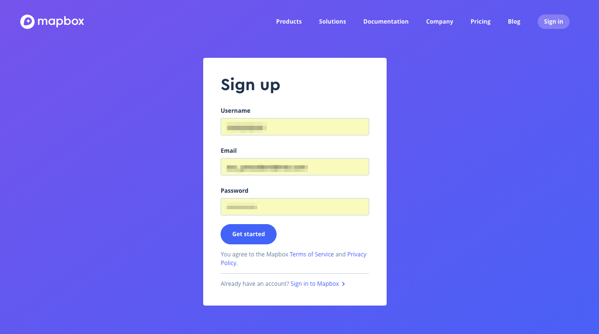

---
## Harmoware-VISを使ってみる

登録後は下記のURLより`アクセストークン`を取得できます。
https://www.mapbox.com/install/


---
## Harmoware-VISを使ってみる

取得したアクセストークンは環境変数として登録しておきます。
```sh
set MAPBOX_ACCESS_TOKEN=XXXXXXXXX
```

---

## Harmoware-VISを使ってみる

まずは`harmoware-demo`というディレクトリーを作成して、そこに`package.json`を作成します。

```
mkdir harmoware-demo
cd harmoware-demo
npm init
```

---

## package.jsonの編集

以下のようなpackage.jsonを作成しましょう。
https://github.com/steelydylan/harmoware-demo/blob/master/package.json

Harmoware-VISはまだ`npm`に公開されていませんので、packageの場所が`github`となることに注意してください。

---

## webpack.config.jsを作成

https://github.com/steelydylan/harmoware-demo/blob/master/webpack.config.js

依存関係を解決するために`mapbox-gl`のエイリアスだけ作っておくことに注意してください。

---

## .babelrcの作成

https://github.com/steelydylan/harmoware-demo/blob/master/.babelrc

`babel`の設定は`react`と`env`があれば充分です。さらに、`transform-object-rest-spread`があればオブジェクトの受け渡しの際に便利かもしれません。

---

## src/index.jsの作成

https://github.com/steelydylan/harmoware-demo/blob/master/src/index.js

Harmoware-VISでは`react`, `redux`を使用して、`action`および`state`を管理しています。

---

## src/containers/app.jsの作成

https://github.com/steelydylan/harmoware-demo/blob/master/src/containers/app.js

`connectToHarmowareVis`関数を使ってコンポーネントにHarmoware-VISの`state`および`action`を`container`コンポーネントに紐付けます。

---

## Harmoware-VISの実行

```sh
npm install
npm run start
```
---

## Harmoware-VISの実行

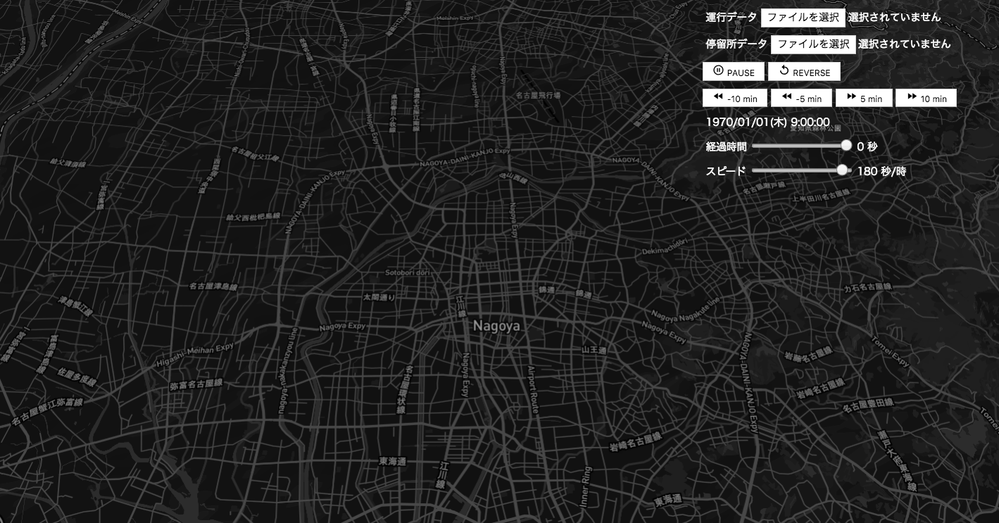

---

## Harmoware-VISの実行

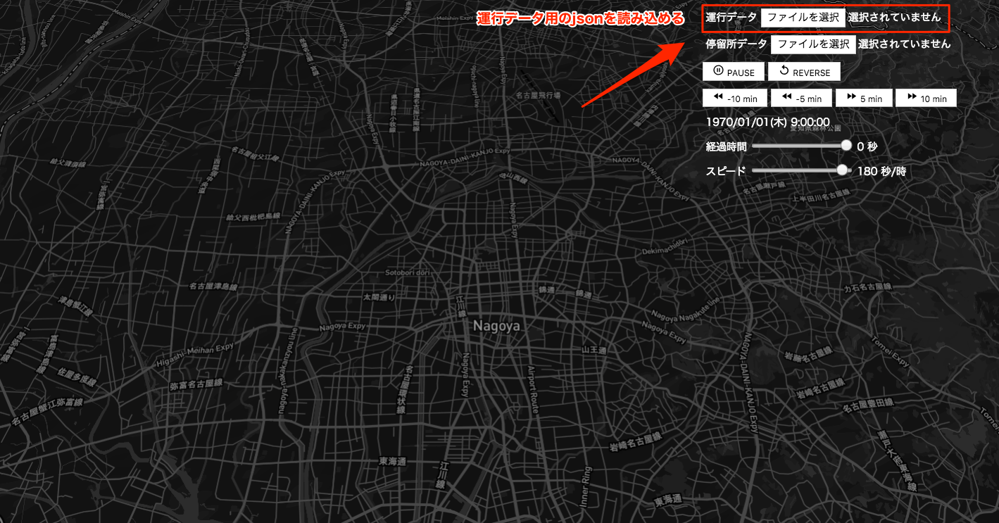


運行データのjsonを読み込むことができます。
以下のjsonファイルを読み込んでみましょう。
https://raw.githubusercontent.com/steelydylan/harmoware-demo/master/json/Moves-tutuji-20180113.json

---

## Harmoware-VISの実行

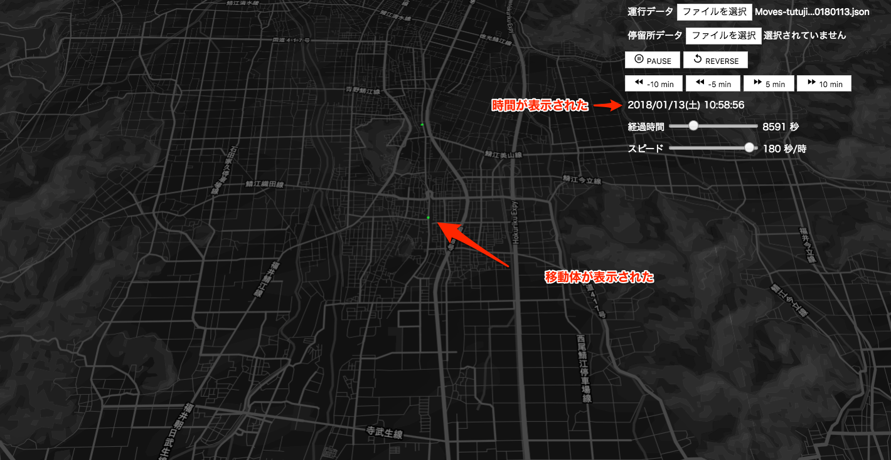

マップ状に移動体が表示され、どの時間にどの位置に移動体がいるのかが可視化されました。

---

## Harmoware-VISの実行

運行データのJSON形式

https://github.com/Harmoware/Harmoware-VIS/#%E9%81%8B%E8%A1%8C%E3%82%B7%E3%83%A5%E3%83%9F%E3%83%AC%E3%83%BC%E3%82%B7%E3%83%A7%E3%83%B3%E3%83%87%E3%83%BC%E3%82%BF%E3%83%95%E3%82%A1%E3%82%A4%E3%83%AB%E3%81%AEjson%E3%83%95%E3%82%A9%E3%83%BC%E3%83%9E%E3%83%83%E3%83%88

---

## Harmoware-VISの実行


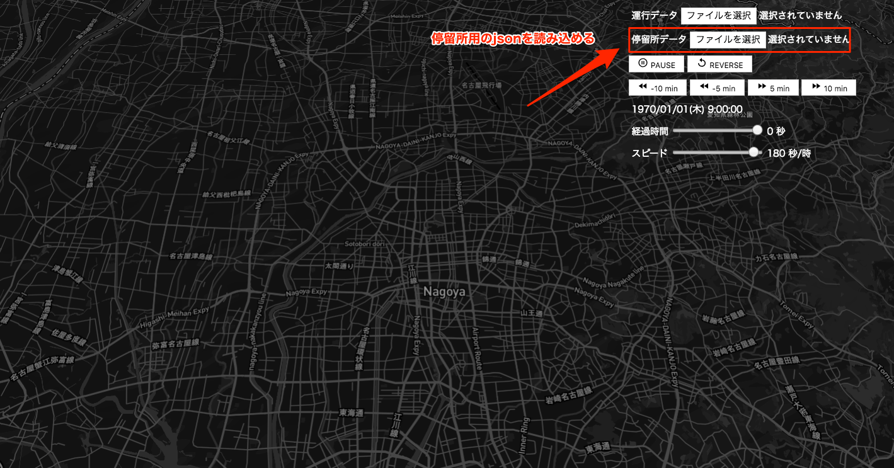


停留所データのjsonを読み込むことができます。
以下のjsonファイルを読み込んでみましょう。
https://raw.githubusercontent.com/steelydylan/harmoware-demo/master/json/Depots-tutuji.json

---

## Harmoware-VISの実行

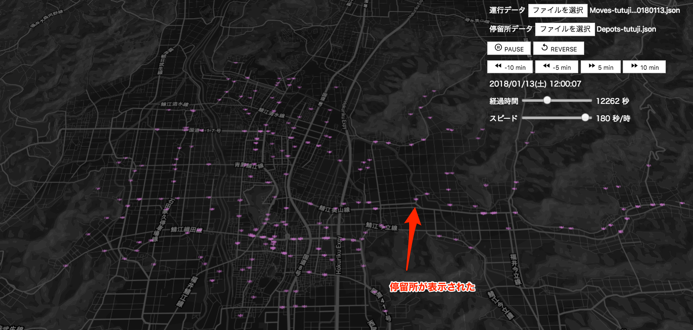

移動体の他に、その移動体が停止する停留所（バス停など）が表示されました。

---
## Harmoware-VISの実行

停留所データのJSON形式

https://github.com/Harmoware/Harmoware-VIS/#%E5%81%9C%E7%95%99%E6%89%80%E6%83%85%E5%A0%B1%E3%83%87%E3%83%BC%E3%82%BF%E3%81%AEjson%E3%83%95%E3%82%A9%E3%83%BC%E3%83%9E%E3%83%83%E3%83%88

---

## Harmoware-VISの実行

### `mouseover`時に移動体の情報を表示する

また、MovesLayer, DepotsLayerは`onHover`の`callback`より`mouseover`時にhoverされたオブジェクトの情報を取得することができます。

```js
new MovesLayer({ routePaths, movesbase, 
  movedData, clickedObject, actions, 
  onHover: (el) => {console.log(el)} 
});
```


---
### Harmoware-VIS レイヤー一覧
また、Harmoware-VISではいくつかのLayerをデフォルトで用意しています。

https://github.com/Harmoware/Harmoware-VIS#harmoware-vis-layers


各レイヤーの`import`
```js
import {  
  MovesLayer,
  MovesNonmapLayer,
  DepotsLayer,
  FixedPointLayer,
  LineMapLayer
} from 'Harmoware-VIS';
```
---

#### MovesLayer

車両などの移動体をmapboxより取得したマップ上に表示します。下の図の緑の円が`MovesLayer`で表示されているオブジェクトです。

```js
import { Harmovislayers, MovesLayer } from 'harmoware-vis';
...

<Harmovislayers layers={[new MovesLayer({
  routePath, 
  movesbase, 
  movedData, 
  clickedObject, 
  actions 
})]}/>
```

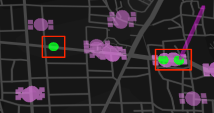

---

#### MovesLayer

クリックすることで、その移動体の辿る経路が緑のライン上で表示されます。

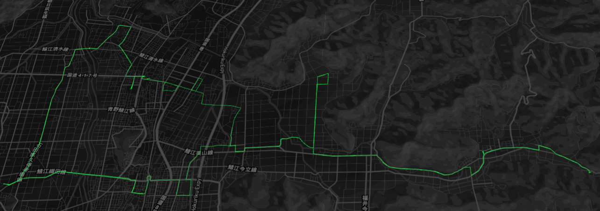


---

#### DepotsLayer

停留所や駅などをmapboxより取得したマップ上に表示します。下の図のピンクの円が`DepotsLayer`で表示されているオブジェクトです。

```js
const {depotsData} = this.props;

<HarmoVisLayers
  layers={[
    new DepotsLayer( { depotsData } )
  ]}
/>
```

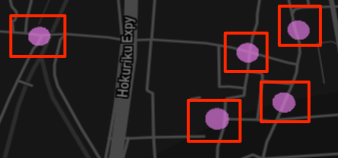

---
### Harmoware-VIS コントロール用のコンポーネント一覧
Harmoware-VISでは自身のState更新用のコンポーネントをいくつか提供しています。
https://github.com/Harmoware/Harmoware-VIS#harmoware-vis-control-component


各コンポーネントの`import`
```js
import { MovesInput, DepotsInput, 
  LinemapInput, AddMinutesButton, 
  PlayButton, PauseButton, ForwardButton, 
  ReverseButton, ElapsedTimeRange, SpeedRange,
  SimulationDateTime
} from 'Harmoware-VIS';
```
---

### MovesInput


移動体データを地図上に可視化するためのファイルを読み込むコンポーネント。
「運行シュミレーションデータ」を設定したファイルを選択するダイアログを表示し、読み込んだデータより Harmoware-VIS の `bounds`、`timeBegin`、`timeLength`、`movesbase` を設定します。

ここからjsonを読み込むことにより、`MovesLayer`が表示されます。


```js
<MovesInput actions={actions} />
```

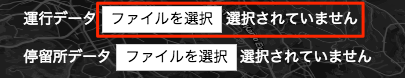

---

### DepotsInput

停留所データを地図上に可視化するためのファイルを読み込むコンポーネント
「停留所情報データ」を設定したファイルを選択するダイアログを表示し、読み込んだデータより `Harmoware-VIS` の `depotsBase` に設定します。

```js
<DepotsInput actions={actions} />
```

ここからjsonを読み込むことにより、`DepotsLayer`が表示されます。


---

## Harmoware-VISの State

以下が、Harmoware-VISが持っている`state`です。
`action` を介して、`state` を更新することができます。
https://github.com/Harmoware/Harmoware-VIS#harmoware-vis-reducer

---

## Harmoware-VISのaction

Harmoware-VISでは以下のactionをデフォルトで用意しています。

https://github.com/Harmoware/Harmoware-VIS#harmoware-vis-actions


---

### containerからstateの取得

例）Harmoware-VISの現在の時間を取得する

```js
const { settime } = this.props;
```

---
## Harmoware-VISのプロジェクト構成

基本的に、Harmoware-VISのプロジェクト構成は型定義のための`types`ディレクトリーや、レイヤーのための`layer`ディレクトリー、ユーティリティのための`library`ディレクトリーが存在する点を除いて、`redux`のスタンダードな構成に従っています。


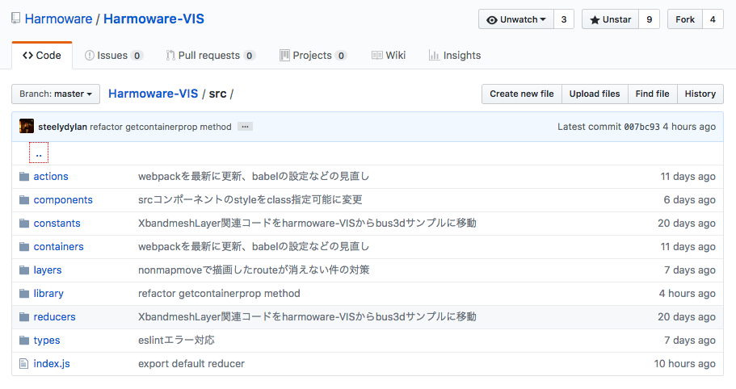


---
## Harmoware-VISのプログラム構成

`Harmoware-VIS`本体は拡張されて使用されることが前提にあるので、前述の`actions`や`reducers`、`components`、`constants`などの設定は全て`Harmoware-VIS`のエントリーポイントで`export`しています。

https://github.com/Harmoware/Harmoware-VIS/blob/master/src/index.js

従って、Harmoware-VISをライブラリとして利用する際は、以下のように`actions`や`reducers`に関わらず、すべからく同一の方法でimport可能です。
```js
import {Actions, MovesInput, DepotsInput, 
  LinemapInput, PlayButton, settings, Container, MovesLayer,
  DepotsLayer, connectToHarmowareVis, getCombinedReducer, reducer}
  from 'harmoware-vis';
```

---

## Harmoware-VIS の拡張

Harmoware-VISでは`redux`を使用しており、移動体や停車場の情報管理のための`store`をデフォルトで用意しています。Harmoware-VISでは、この`store`を拡張するための機能が用意されています。`store`を拡張することで、移動体や停留所以外の情報も管理できるようになります。今回は下のデモのようにバンクーバーの地域ごとの時価をグラフ表示できるようにしてみましょう。

http://deck.gl/showcases/gallery/geojson-layer

以下のjsonデータを読み込み、表示できるようにします。
https://raw.githubusercontent.com/uber-common/deck.gl-data/master/examples/geojson/vancouver-blocks.json

---

## Harmoware-VIS の拡張


1. src/reducer/geo.jsの作成
2. action及びconstantsの作成
3. baseのreducerと結合
4. 結合したreducerの使用
5. geo情報を読み込むためのコンポーネントを設置
6. containerとstoreの接続


---

## 1. src/reducer/geo.jsの作成

まずは、jsonデータをstateとして保持するためのreducerを作成します。
今回は`geo.js`としています。

https://github.com/steelydylan/harmoware-demo2/blob/master/src/reducers/geo.js

---
## 2. action及びconstantsの作成

先ほど作成した`geo.js`を活用するためにそれ用の`action`と`constants`を定義します。

`src/constants/index.js`
```js
export const SETGEO = 'SETGEO';
```

`src/actions/index.js`
```
import * as types from '../constants';

export const setGeo = (geo) => ( {
  type: types.SETGEO, geo
});
```
---

## 3. baseのreducerと結合

`getCombinedReducer`という`harmoware-vis`で用意されたAPIを使用して自作reducerとHarmoware-VISのreducerを結合できます。

```js
import geo from './geo';
import { getCombinedReducer } from 'harmoware-vis';


export default getCombinedReducer({ geo });
```

---

## 4. 結合したreducerの使用

先ほど合体したreducerをimportして`store`を作成します。
react-reduxモジュールから`import`した`Provider`コンポーネントで`container（App）`を囲います。

```js
import App from './containers';
import { Provider } from 'react-redux';
import reducer from './reducers';
const store = createStore(reducer);


render(
  <Provider store={store}>
    <App />
  </Provider>,
  document.getElementById('app')
);
```

---
## 5. geo情報を読み込むためのコンポーネントを設置

次に実際にファイルを読み込み`action`を実行するためのコンポーネントを作成します。
この時に、`actions.setGeo()`だけではなく、読み込まれた位置に`viewport`を移動するために、`actions.setViewport()`も実行すると親切です。

https://github.com/steelydylan/harmoware-demo2/blob/master/src/components/geo-layer-input.js

---

## 6. containerとstoreの接続

先ほどの`geo-layer-input.js`を含んだ`container`コンポーネントを作成し、`connectToHarmowareVis`メソッドで、`container`と`Harmoware-VIS`を結びつけます。

https://github.com/steelydylan/harmoware-demo2/blob/master/src/containers/app.js

---
以下のように`json`を読み込むとバンクーバーの時価情報が表示されていれば成功です。
このように、Harmoware-VISを拡張するには`redux`の知識が必要になってきます。
実際のソースコードはこちらにおいてあります。
https://github.com/steelydylan/harmoware-demo2/

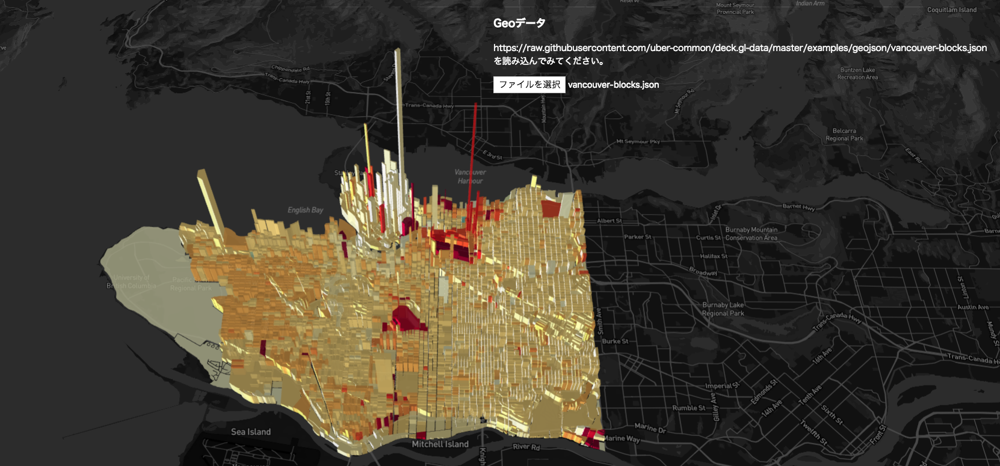

---

以上で、JavaScriptの入門から `Harmoware-VIS`の使い方、カスタマイズ方法までのチュートリアルは終了です。`Harmoware-VIS`のさらに詳しいカスタマイズ方法は以下の3つのサンプルを見ていただくと参考になるかと思います。


- https://github.com/Harmoware/Harmoware-VIS/tree/master/examples/bus3d
- https://github.com/Harmoware/Harmoware-VIS/tree/master/examples/visualize-sample-nonmap
- https://github.com/Harmoware/Harmoware-VIS/tree/master/examples/visualize-sample

---

# 今後の課題

- npmへの公開
- i18n対応
- かっこいいスタイルをつける！

などなど！