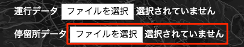

<!-- page_number: true -->

# deck.glを利用した、マップ上に移動体の情報を表示するライブラリの開発について

<style>
.slide pre code {
    font-size: 20px !important;
}
</style>
---

# 目次

1. モダン JavaScript 開発の環境構築
2. Reactを使ったフロントエンド開発
3. Reduxを使ったアプリケーション構築
4. deck.glの紹介
5. Harmoware-VISとは
6. Harmoware-VISを使ってみる

--- 

# 1. モダン JavaScript 開発の環境構築

---

## Node.jsをインストール

モダンなJavaScript開発の環境構築にはNode.jsのインストールが必要不可欠です。まずはNode.jsを使えるようにしましょう。

---

## Node.jsをインストール
下記のサイトを利用することでインストールマネージャーを使って簡単にNode.jsの環境が整います。

https://nodejs.org/en/download/

---

## Node.jsのバージョン管理ツール

プロジェクトに応じて使用するNode.jsのバージョンが異なるケースもあります。またチーム間で使用するNode.jsのバージョンを合わせておかないと、Node.jsの実行結果が異なるケースも出てきてしまいます。そう行った時にはNode.jsのバージョン管理ツールを使うと良いでしょう。

---

## Node.jsのバージョン管理ツール

Macでは`nodebrew`や`ndenv`、Windowsでは`nodist`というツールを使ってNode.jsのバージョンコントロールができます。

---

## Node.jsのバージョン管理ツール（Mac編）

今回は`ndenv`というバージョン管理ツールをインストールしてみましょう。
https://github.com/riywo/ndenv

Macで`ndenv`をインストールするには下記のコマンドをターミナル上に入力します。

```sh
$ git clone https://github.com/riywo/ndenv ~/.ndenv
$ echo 'export PATH="$HOME/.ndenv/bin:$PATH"' >> ~/.bash_profile
$ echo 'eval "$(ndenv init -)"' >> ~/.bash_profile
$ exec $SHELL -l
```

---
## Node.jsのバージョン管理ツール（Mac編）


`ndenv`インストール後は、下記のように`ndenv`コマンドが利用できるようになり、Node.jsの各バージョンのインストールや、プロジェクト内でのバージョン指定ができるようになります。

Node.jsの特定バージョンインストール
```sh
$ ndenv install v9.2.0
```

Node.jsのバージョン指定

```sh
$ ndenv local v9.2.0
```

現在のNodeのバージョンを確認


```sh
$ node -v
v9.2.0
```

---
## Node.jsのバージョン管理ツール（Mac編）


```sh
$ ndenv local v9.2.0
```

また上記のコマンドを入力すると、`.node-version`というファイルが自動で生成され、このファイルがあることによって、自動で`node`のバージョンも`9.2.0`になります。チームでプロダクトを開発する時に`git`に`.node-version`を含めておけば、意識することなく、同じNode.jsのバージョンでプロダクト開発をすることができます。


---

## Node.jsのバージョン管理ツール（Mac編）


また、現在インストールされているNode.jsのバージョンを下記のコマンドで一覧表示できます。

```sh
$ ndenv versions
  v6.10.1
  v6.10.2
  v6.9.2
  v6.9.4
* v7.5.0
```

`*`が表示されているバージョンがデフォルトのNode.jsのバージョンとなります。

---

## Node.jsのバージョン管理ツール（Windows編）

Macでいう`ndenv`とよく似たNode.jsバージョン管理ツールとして、Windowsでは`nodist`というツールが使われます。`nodist`はMacと同じ`.node-version`ファイルを参照するので、Macで開発していてもWindowsで開発していてもNode.jsのバージョンを合わせることができます。

---
## Node.jsのバージョン管理ツール（Windows編）

Windowsの場合、インストールは非常に楽で下記のリンクよりインストーラーを実行することで自動的に環境変数が設定され、`nodist`へパスが通ります。

https://github.com/marcelklehr/nodist/releases

インストールできたかどうか、下記のコマンドで確かめてみましょう。

```
$ nodist -v
```

---

## Node.jsのバージョン管理ツール（Windows編）

Node.jsの特定バージョンインストール

```sh
$ nodist + 9.2.0
```

Node.jsのバージョン指定

```sh
$ nodist 9.2.0
```

```sh
$ node -v
v9.2.0
```

---
## Node.jsのバージョン管理ツール（Windows編）

また、現在インストールされているNode.jsのバージョンを下記のコマンドで一覧表示できます。

```sh
$ nodist dist
  6.10.2
  6.9.2
  6.9.4
```
---

## Node.jsのパッケージ管理ツール npm について

次は、Node.jsのパッケージ管理ツール`npm`の使い方をご紹介します。
`npm`は元々は`Node.js`用のパッケージ管理ツールだったのですが、現在ではフロントエンド用のライブラリを管理するためのツールとしても使用されます。
最近のJavaScriptプロジェクトでは、`npm init` コマンドより`package.json`というファイルを作成するのが一般的です。

---
## Node.jsのパッケージ管理ツール npm について

```sh
$ npm init
```

実行するとプロジェクト名やバージョン、概要などの入力を求められますが、決まってなければ`enter`を入力することでスキップできます。

最終的には以下のようなJSONファイルが生成されます。

```json
{
  "name": "test",
  "version": "1.0.0",
  "description": "",
  "main": "index.js",
  "scripts": {
    "test": "echo \"Error: no test specified\" && exit 1"
  },
  "author": "",
  "license": "ISC"
}
```

---
## Node.jsのパッケージ管理ツール npm について

この`package.json`は`npm`でインストールしたライブラリの情報が記述されます。
試しに下記のコマンドをターミナル上で入力してみましょう

```sh
$ npm install jquery --save
```

---
## Node.jsのパッケージ管理ツール npm について

すると、`package.json`にインストールした、`jquery`に関する情報が追記されました。この機能のおかげで使用しているライブラリのバージョンを自分や他の人が瞬時に把握することができます。

```json
{
  "name": "test",
  "version": "1.0.0",
  "description": "",
  "main": "index.js",
  "scripts": {
    "test": "echo \"Error: no test specified\" && exit 1"
  },
  "author": "",
  "license": "ISC",
  "dependencies": {
    "jquery": "^3.3.1"
  }
}
```

---
## Node.jsのパッケージ管理ツール npm について

また、`package.json`によく使うコマンドを登録することができます。
`package.json`の`scripts`という項目にコマンドを登録していきます。`npm init`した段階では、デフォルトで、`test`というコマンドが書かれており、これは`npm run test`とターミナルに入力することで、実行できます。

このような`package.json`によるコマンドライン追加を`npm scripts`と呼びます。

---
## Node.jsのパッケージ管理ツール npm について

試しに、`http-server`というモジュールをインストールして簡易Webサーバーを立ち上げてみましょう。

はじめに以下のコマンドを入力します。

```sh
$ npm install http-server --save-dev
```

---
## Node.jsのパッケージ管理ツール npm について

次に、`npm scripts`を追加します。package.jsonを編集し`serve`というコマンドを追加しましょう。`npm scripts`にコマンドを記述することにより、`./node_modules/.bin`の中に自動でパスが通るため、環境変数の設定などは不要です。

```json
{
  "name": "test",
  "version": "1.0.0",
  "description": "",
  "main": "index.js",
  "scripts": {
    "test": "echo \"Error: no test specified\" && exit 1",
    "serve": "http-server"
  },
  "author": "",
  "license": "ISC",
  "devDependencies": {
    "http-server": "^0.11.1"
  }
}
```

---
## Node.jsのパッケージ管理ツール npm について

`npm run serve`を実行すると下記のURLにて現在のディレクトリがドキュメントルートになった、簡易サーバーが立ち上がるはずです。

http://localhost:8080/

---
## ES2015以降のJavaScript開発を行うためのWebpackとBabelについて


ここでは、モダン JavaScript開発に欠かせない`Webpack`と`Babel`というツールの導入方法をご紹介します。


---
## Webpackとは


複数のJavaScriptファイルの依存関係を解決して、1ファイルにまとめてくれるツール。JavaScriptだけではなく、sassなどをコンパイルしてモジュールとして取り込むこともできます。


---
## Webpackの導入
プロジェクトの開始

次にWebpackの導入です。

```sh
mkdir my_project
cd ./my_project
npm init
```

---
## Webpackの導入
webpackのインストール

次にいよいよWebpackをプロジェクトに追加します。以下のコマンドを入力することで`node_modules`というディレクトリーが自動で作成され、その中に、`webpack`とその依存モジュールがインストールされます。

```js
npm i webpack --save-dev
```

---

## Webpackの導入
webpack-cliのインストール

またWebpack4からは別途、`webpack-cli`というモジュールが必要になりました。これは`webpack`モジュールをコマンドラインから利用するために必要なモジュールです。


```js
npm i webpack-cli --save-dev
```

---
## Webpackの導入
ビルドコマンドの実行

`webpack`及び、`webpack-cli`をインストールしたことにより、プロジェクト内で`webpack`を利用できるようになりました。package.jsonの`scripts`の中に以下のコードを追加してみましょう。そうすることで、`npm run build`とターミナル上で実行することで`webpack`が動作します。

```json
"scripts": {
  "build": "webpack"
}
```
---
## Webpackの導入
ビルドコマンドの実行

デフォルトでは、`./src/index.js`がエントリーポイントになっているので、`src`ディレクトリーを作成して、その中にindex.jsを設置します。

例えば、以下のようなJavaScriptを記述します。

```js
console.log('hello world');
```

---
## Webpackの導入
ビルドコマンドの実行

そして、`npm run build` を実行すると`./dist/main.js`が作成されているのがわかると思います。


---
## Webpackの導入
ビルドコマンドの実行

エントリーポイントを指定したい場合

```js
"scripts": {
  "build": "webpack ./src/index.js --output ./dest/bundle.js"
}
```

---
## Webpackの導入
developmentモードと、buildモード

```js
"dev": "webpack --mode development",
"build": "webpack --mode production"
```

---
## Webpackの導入
developmentでのビルドを実行

実行スピードが早いが、minifyや最適化されていません。素早く実行結果を確認したいときに有効です。


```sh
npm run dev
```


---
# webpack-dev-serverの利用

webpack-dev-serverのインストール

```sh
npm i webpack-dev-server --save-dev
```

```sh
"start": "webpack-dev-server --mode development --open",
"build": "webpack --mode production"
```

```sh
npm run start
```

---
# webpack-dev-serverの利用

実行すると自動でブラウザが立ち上がり、`JavaScript`を保存した段階でブラウザが自動で再リロードされ、変更が反映されていることが確認できると思います。

---

# Babelの使用

- babel-core
- babel-loader
- babel-preset-env

が必要

---
# Babelの使用

先ほどのパッケージ群をインストールします。

```sh
npm i babel-core babel-loader babel-preset-env --save-dev
```

---
# Babelの使用

.babelrcの設定

`babel-preset-env`を使うことで、ターゲットブラウザのバージョンを指定して必要なBabelの`preset`を読み込んでくれます。

```json
{
    "presets": [
        "env"
    ]
}
```

---

# Babelの使用

webpack.config.jsの作成

```js
module.exports = {
  module: {
    rules: [
      {
        test: /\.js$/,
        exclude: /node_modules/,
        use: {
          loader: "babel-loader"
        }
      }
    ]
  }
};
```

---

下記のような`JavaScript`を書いてみてください。`npm run build`を実行することで、`dist/main.js`にアロー関数が解決されたJavaScriptが生成されています。

index.js
```js
const sayHello = (person) => {
  console.log(`hello ${person}`);
}
```

---

# 3.Reactを使ったフロントエンド開発


---

# Reactとは

- 平たく言えば、テンプレートエンジン
- 仮装DOMを利用したHTMLの差分更新が特徴


---
# Reactとは

他の似たようなUI系ライブラリとして以下があります。

- Vue.js（ https://vuejs.org/ ）
- Riot.js（ https://riot.js.org/ ）
- Angular.js（ https://angularjs.org/ ）
- Polymer（ https://www.polymer-project.org/ ）


---


# ではなぜReactなのか？

- あくまでViewの差分更新のみの機能に特化している
- ES2015以降の知識とJSXの知識さえあれば実装できる。

---

# Reactを実行してみよう

```sh
git clone https://github.com/steelydylan/react-sample.git .
npm install
npm run start
```


---
# Reactを実行してみよう

出力結果

増加ボタンを押すことで、数字が1増加し、減少ボタンを押すことで1減少します。


---
# Reactを実行してみよう

カウント数を0にするボタンをSampleコンポーネントに追加してみましょう。


1. renderメソッド内にボタンを追加

```js
<button onClick={this.reset.bind(this)}>リセット</button>
```
---
# Reactを実行してみよう

2. resetメソッドを定義

```js
...
reset() {
  this.setState({
    count: 0
  });
}
...
```

---
# Reactを利用する際に便利なJSX記法

JSXはReactを完結に記述するためにFacebook社によって開発された記法です。
HTMLに似た書き方ですが、`class`を`className`と書いたり、若干、HTMLとは記述がことなります。

---
# Reactを利用する際に便利なJSX記法
JSXの記法例

https://github.com/steelydylan/react-sample/blob/master/src/index.js

---
# Reactを利用する際に便利なJSX記法

属性に代入する値は文字列の場合はそのまま`"`で囲うことができるが、数字や変数などは`{}`で囲う必要があります。`style`はオブジェクトで記述する点にご注意ください。

```js
const Modal = <div className="modal" tabIndex={-1} style={{display:'none'}}>
  <div className="modal-inner">
    <div className="modal-header">
    </div>
    <div className="modal-body">
    </div>
  </div>
</div>
```


---
# Reactのライフサイクル

また、Reactにはライフサイクルというものがあり、ライフサイクルを覚えておくと、コンポーネントの生成時や削除時に処理を挟むことができます。

---

## Reactのライフサイクル

### `componentWillMount()`

コンポーネントがhtml上に出力される寸前の処理

---

## Reactのライフサイクル

### `componentDidMount()`

コンポーネントがhtml上に出力された直後の処理

---
## Reactのライフサイクル

### `componentWillReceiveProps(props)`

コンポーネントが親コンポーネントから値を受け取る直前の処理。引数には受け取る予定の`props`の値が入っている。

---
## Reactのライフサイクル

### `componentWillUnmount()`

コンポーネントがhtml上に出力されなくなった時の処理

---
# Reactの導入
パッケージをインストール

```sh
npm install react react-dom --save
```

---
# Reactの導入

JSXをサポートするための文法プリセットをインストール

```sh
npm i babel-preset-react --save-dev
```

.babelrcの設定

```js
{
  "presets": ["env", "react"]
}
```

---


# 4. Reduxを使ったアプリケーション構築

---

# Reduxとは
アプリケーションの状態（`State`）を環境に左右されず一貫したルールのもと管理するための仕組みです。


---
# Reduxとは

Reduxを理解するのに一番重要になってくるのが`Store`という概念です。
`Store`はアプリケーションの状態である`State`を保持し、そのステートは`Action`というチケットを介して、`Reducer`という関数が実行され、その結果が新しい`State`として再び`Store`にセットされます。


---
# Redux導入方法


```sh
npm install redux --save
```

---
# ReactとReduxを連携する

ReduxのState管理の仕組みとReactのコンポーネントを紐づけるために`react-redux`というツールを使います。`react-redux`を使うことによって、`Store`の状態を`Component`に紐づけたり、`Component`から`Action`を実行することができます。

---
# ReactとReduxを連携する


---
# ReactとReduxを連携する
インストール方法

```sh
npm install react-redux --save
```

---
# ReactとReduxを連携する

下記のコードでは`mapStateToProps` `mapDispatchToProps`を`connect`することで、`Reducer`の`state`や`action`をAppコンポーネントのpropsで参照可能にしています。

https://gist.github.com/steelydylan/6654d72c6c95f5b9a1fbeaa209e6d280

--- 
# ReactとReduxを連携する

連携後は、`connect`されたコンポーネントから、`this.props.state`、`this.props.actions.action()`のような形で呼び出すことができます。

---
# React Redux 連携サンプル

https://github.com/steelydylan/react-redux-sample

```sh
git clone https://github.com/steelydylan/react-redux-sample.git .
npm install
npm run start
```

---
# React Redux 連携サンプル

## 実行画面


---
# React Redux 連携サンプル

現在、増加ボタンと減少ボタンがあり、ボタンをクリックすると、値が±1増減します。さらに、`RESET`というアクションを追加して、値を`0`に戻すボタンを追加してみましょう。

---
# React Redux 連携サンプル

1. `constants/ActionTypes.js`で`RESET`を定数として追加

```js
export const RESET = 'RESET';
```

---

2. `actions/index.js`で`reset`をアクションとして追加

```js
export const reset = () => ({ type: types.RESET });
```

---

3. `reducers/index.js`で`RESET`に対する処理を記述

```js
...
case types.RESET:
   return Object.assign({}, state, { count: 0 });
...
```

---

4. `components/sample.js`でアクションを実行するためのボタンを追加


```js
<button onClick={() => { this.props.reset(); }}>
  リセット
</button>
```

---
# 5. deck.glの紹介

---
# deck.glの紹介

WebGLベースの地理情報視覚化用のコンポーネント集
Reactとの連携が可能。


---
# deck.gl 導入方法

以下の3つのライブラリーが必要

- react-map-gl
- luma.gl
- deck.gl

```sh
npm install deck.gl luma.gl react-map-gl --save
```

---
# react-map-gl

OpenStreetMapのライブラリであるmap-glをReactベースで使えるようにしたライブラリ。
Uber社が開発


---
# luma.gl

Uber社が開発した、WebGL用データビジュアライゼーションライブラリー。
これを利用して、deck.glが動作します。


---

# 6. React + deck.gl

記述例

```js
import DeckGL, {ArcLayer} from 'deck.gl';

const flights = new ArcLayer({
  data: [] // Some flight points,
  ...
});

<MapGL
  {...viewport} mapStyle={mapStyle} perspectiveEnabled
  onChangeViewport={onChangeViewport}
  mapboxApiAccessToken={mapboxApiAccessToken}
>
  <DeckGL width={1920} height={1080} layers={[flights]} />
</MapGL>

```

---

# 6. Harmoware-VISとは

---


# Hamoware-VIS とは

React Reduxを使って、deck.gl上での移動体の情報可視化や管理などを行うためのライブラリーで、主に名古屋大学河口研究室が中心になって開発しています。
先ほど紹介した以下のライブラリに依存しています。

- react-map-gl
- luma.gl
- deck.gl


---
# Hamoware-VIS とは

`Harmowrare-VIS`の実行画面


---

## Harmoware-VISを使うメリット

1. 地理情報の時間更新の自動処理
2. 時間コントロール系のコンポーネントを用意
3. 移動体や停留所を表示するためのコンポーネントを用意

---


# 7. Harmoware-VISを使ってみる

---

## Harmoware-VISを使ってみる

まずは、`mapbox`に登録してアクセストークンを取得する必要があります。

https://www.mapbox.com/signup/?plan=paygo-1


---
## Harmoware-VISを使ってみる

登録後は下記のURLより`アクセストークン`を取得できます。
https://www.mapbox.com/install/


---
## Harmoware-VISを使ってみる

取得したアクセストークンは環境変数として登録しておきます。
```sh
set MAPBOX_ACCESS_TOKEN=XXXXXXXXX
```

---

## Harmoware-VISを使ってみる

まずは`harmoware-demo`というディレクトリーを作成して、そこに`package.json`を作成します。

```
mkdir harmoware-demo
cd harmoware-demo
npm init
```

---

## package.jsonの編集

以下のようなpackage.jsonを作成しましょう。
https://github.com/steelydylan/harmoware-demo/blob/master/package.json

Harmoware-VISはまだ`npm`に公開されていませんので、packageの場所が`github`となることに注意してください。

---

## webpack.config.jsを作成

https://github.com/steelydylan/harmoware-demo/blob/master/webpack.config.js

依存関係を解決するために`mapbox-gl`のエイリアスだけ作っておくことに注意してください。

---

## .babelrcの作成

https://github.com/steelydylan/harmoware-demo/blob/master/.babelrc

`babel`の設定は`react`と`env`があれば充分です。さらに、`transform-object-rest-spread`があればオブジェクトの受け渡しの際に便利かもしれません。

---

## src/index.jsの作成

https://github.com/steelydylan/harmoware-demo/blob/master/src/index.js

Harmoware-VISでは`react`, `redux`を使用して、`action`および`state`を管理しています。

---

## src/containers/app.jsの作成

https://github.com/steelydylan/harmoware-demo/blob/master/src/containers/app.js

`connectToHarmowareVis`関数を使ってコンポーネントにHarmoware-VISの`state`および`action`を`container`コンポーネントに紐付けます。

---

## Harmoware-VISの実行

```sh
npm install
npm run start
```
---

## Harmoware-VISの実行


---

## Harmoware-VISの実行


運行データのjsonを読み込むことができます。
以下のjsonファイルを読み込んでみましょう。
https://raw.githubusercontent.com/steelydylan/harmoware-demo/master/json/Moves-tutuji-20180113.json

---

## Harmoware-VISの実行


マップ状に移動体が表示され、どの時間にどの位置に移動体がいるのかが可視化されました。

---

## Harmoware-VISの実行

運行データのJSON形式

https://github.com/Harmoware/Harmoware-VIS/#%E9%81%8B%E8%A1%8C%E3%82%B7%E3%83%A5%E3%83%9F%E3%83%AC%E3%83%BC%E3%82%B7%E3%83%A7%E3%83%B3%E3%83%87%E3%83%BC%E3%82%BF%E3%83%95%E3%82%A1%E3%82%A4%E3%83%AB%E3%81%AEjson%E3%83%95%E3%82%A9%E3%83%BC%E3%83%9E%E3%83%83%E3%83%88

---

## Harmoware-VISの実行


停留所データのjsonを読み込むことができます。
以下のjsonファイルを読み込んでみましょう。
https://raw.githubusercontent.com/steelydylan/harmoware-demo/master/json/Depots-tutuji.json

---

## Harmoware-VISの実行


移動体の他に、その移動体が停止する停留所（バス停など）が表示されました。

---
## Harmoware-VISの実行

停留所データのJSON形式

https://github.com/Harmoware/Harmoware-VIS/#%E5%81%9C%E7%95%99%E6%89%80%E6%83%85%E5%A0%B1%E3%83%87%E3%83%BC%E3%82%BF%E3%81%AEjson%E3%83%95%E3%82%A9%E3%83%BC%E3%83%9E%E3%83%83%E3%83%88

---

## Harmoware-VISの実行

### `mouseover`時に移動体の情報を表示する

また、MovesLayer, DepotsLayerは`onHover`の`callback`より`mouseover`時にhoverされたオブジェクトの情報を取得することができます。

```js
new MovesLayer({ routePaths, movesbase, 
  movedData, clickedObject, actions, 
  onHover: (el) => {console.log(el)} 
});
```


---
### Harmoware-VIS レイヤー一覧
また、Harmoware-VISではいくつかのLayerをデフォルトで用意しています。

https://github.com/Harmoware/Harmoware-VIS#harmoware-vis-layers


各レイヤーの`import`
```js
import {  
  MovesLayer,
  MovesNonmapLayer,
  DepotsLayer,
  FixedPointLayer,
  LineMapLayer
} from 'Harmoware-VIS';
```
---

#### MovesLayer

車両などの移動体をmapboxより取得したマップ上に表示します。下の図の緑の円が`MovesLayer`で表示されているオブジェクトです。

```js
import { Harmovislayers, MovesLayer } from 'harmoware-vis';
...

<Harmovislayers layers={[new MovesLayer({
  routePath, 
  movesbase, 
  movedData, 
  clickedObject, 
  actions 
})]}/>
```


---

#### MovesLayer

クリックすることで、その移動体の辿る経路が緑のライン上で表示されます。


---

#### DepotsLayer

停留所や駅などをmapboxより取得したマップ上に表示します。下の図のピンクの円が`DepotsLayer`で表示されているオブジェクトです。

```js
const {depotsData} = this.props;

<HarmoVisLayers
  layers={[
    new DepotsLayer( { depotsData } )
  ]}
/>
```


---
### Harmoware-VIS コントロール用のコンポーネント一覧
Harmoware-VISでは自身のState更新用のコンポーネントをいくつか提供しています。
https://github.com/Harmoware/Harmoware-VIS#harmoware-vis-control-component


各コンポーネントの`import`
```js
import { MovesInput, DepotsInput, 
  LinemapInput, AddMinutesButton, 
  PlayButton, PauseButton, ForwardButton, 
  ReverseButton, ElapsedTimeRange, SpeedRange,
  SimulationDateTime
} from 'Harmoware-VIS';
```
---

### MovesInput


移動体データを地図上に可視化するためのファイルを読み込むコンポーネント。
「運行シュミレーションデータ」を設定したファイルを選択するダイアログを表示し、読み込んだデータより Harmoware-VIS の `bounds`、`timeBegin`、`timeLength`、`movesbase` を設定します。

ここからjsonを読み込むことにより、`MovesLayer`が表示されます。


```js
<MovesInput actions={actions} />
```


---

### DepotsInput

停留所データを地図上に可視化するためのファイルを読み込むコンポーネント
「停留所情報データ」を設定したファイルを選択するダイアログを表示し、読み込んだデータより `Harmoware-VIS` の `depotsBase` に設定します。

```js
<DepotsInput actions={actions} />
```

ここからjsonを読み込むことにより、`DepotsLayer`が表示されます。



---

## Harmoware-VISの State

以下が、Harmoware-VISが持っている`state`です。
`action` を介して、`state` を更新することができます。
https://github.com/Harmoware/Harmoware-VIS#harmoware-vis-reducer

---

## Harmoware-VISのaction

Harmoware-VISでは以下のactionをデフォルトで用意しています。

https://github.com/Harmoware/Harmoware-VIS#harmoware-vis-actions


---

### containerからstateの取得

例）Harmoware-VISの現在の時間を取得する

```js
const { settime } = this.props;
```

---
## Harmoware-VISのプロジェクト構成

基本的に、Harmoware-VISのプロジェクト構成は型定義のための`types`ディレクトリーや、レイヤーのための`layer`ディレクトリー、ユーティリティのための`library`ディレクトリーが存在する点を除いて、`redux`のスタンダードな構成に従っています。


---
## Harmoware-VISのプログラム構成

`Harmoware-VIS`本体は拡張されて使用されることが前提にあるので、前述の`actions`や`reducers`、`components`、`constants`などの設定は全て`Harmoware-VIS`のエントリーポイントで`export`しています。

https://github.com/Harmoware/Harmoware-VIS/blob/master/src/index.js

従って、Harmoware-VISをライブラリとして利用する際は、以下のように`actions`や`reducers`に関わらず、すべからく同一の方法でimport可能です。
```js
import {Actions, MovesInput, DepotsInput, 
  LinemapInput, PlayButton, settings, Container, MovesLayer,
  DepotsLayer, connectToHarmowareVis, getCombinedReducer, reducer}
  from 'harmoware-vis';
```

---

## Harmoware-VIS の拡張

Harmoware-VISでは`redux`を使用しており、移動体や停車場の情報管理のための`store`をデフォルトで用意しています。Harmoware-VISでは、この`store`を拡張するための機能が用意されています。`store`を拡張することで、移動体や停留所以外の情報も管理できるようになります。今回は下のデモのようにバンクーバーの地域ごとの時価をグラフ表示できるようにしてみましょう。

http://deck.gl/showcases/gallery/geojson-layer

以下のjsonデータを読み込み、表示できるようにします。
https://raw.githubusercontent.com/uber-common/deck.gl-data/master/examples/geojson/vancouver-blocks.json

---

## Harmoware-VIS の拡張


1. src/reducer/geo.jsの作成
2. action及びconstantsの作成
3. baseのreducerと結合
4. 結合したreducerの使用
5. geo情報を読み込むためのコンポーネントを設置
6. containerとstoreの接続


---

## 1. src/reducer/geo.jsの作成

まずは、jsonデータをstateとして保持するためのreducerを作成します。
今回は`geo.js`としています。

https://github.com/steelydylan/harmoware-demo2/blob/master/src/reducers/geo.js

---
## 2. action及びconstantsの作成

先ほど作成した`geo.js`を活用するためにそれ用の`action`と`constants`を定義します。

`src/constants/index.js`
```js
export const SETGEO = 'SETGEO';
```

`src/actions/index.js`
```
import * as types from '../constants';

export const setGeo = (geo) => ( {
  type: types.SETGEO, geo
});
```
---

## 3. baseのreducerと結合

`getCombinedReducer`という`harmoware-vis`で用意されたAPIを使用して自作reducerとHarmoware-VISのreducerを結合できます。

```js
import geo from './geo';
import { getCombinedReducer } from 'harmoware-vis';


export default getCombinedReducer({ geo });
```

---

## 4. 結合したreducerの使用

先ほど合体したreducerをimportして`store`を作成します。
react-reduxモジュールから`import`した`Provider`コンポーネントで`container（App）`を囲います。

```js
import App from './containers';
import { Provider } from 'react-redux';
import reducer from './reducers';
const store = createStore(reducer);


render(
  <Provider store={store}>
    <App />
  </Provider>,
  document.getElementById('app')
);
```

---
## 5. geo情報を読み込むためのコンポーネントを設置

次に実際にファイルを読み込み`action`を実行するためのコンポーネントを作成します。
この時に、`actions.setGeo()`だけではなく、読み込まれた位置に`viewport`を移動するために、`actions.setViewport()`も実行すると親切です。

https://github.com/steelydylan/harmoware-demo2/blob/master/src/components/geo-layer-input.js

---

## 6. containerとstoreの接続

先ほどの`geo-layer-input.js`を含んだ`container`コンポーネントを作成し、`connectToHarmowareVis`メソッドで、`container`と`Harmoware-VIS`を結びつけます。

https://github.com/steelydylan/harmoware-demo2/blob/master/src/containers/app.js

---
以下のように`json`を読み込むとバンクーバーの時価情報が表示されていれば成功です。
このように、Harmoware-VISを拡張するには`redux`の知識が必要になってきます。
実際のソースコードはこちらにおいてあります。
https://github.com/steelydylan/harmoware-demo2/


---

以上で、JavaScriptの入門から `Harmoware-VIS`の使い方、カスタマイズ方法までのチュートリアルは終了です。`Harmoware-VIS`のさらに詳しいカスタマイズ方法は以下の3つのサンプルを見ていただくと参考になるかと思います。


- https://github.com/Harmoware/Harmoware-VIS/tree/master/examples/bus3d
- https://github.com/Harmoware/Harmoware-VIS/tree/master/examples/visualize-sample-nonmap
- https://github.com/Harmoware/Harmoware-VIS/tree/master/examples/visualize-sample