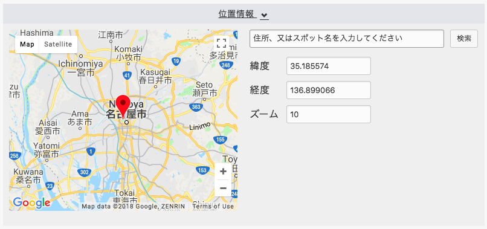
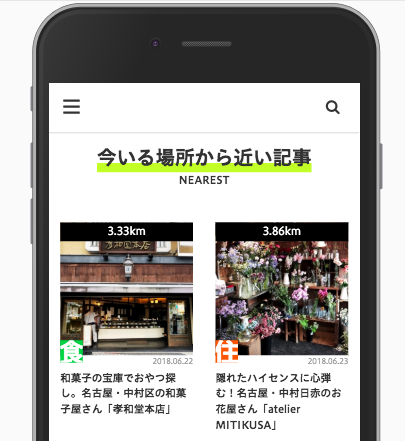
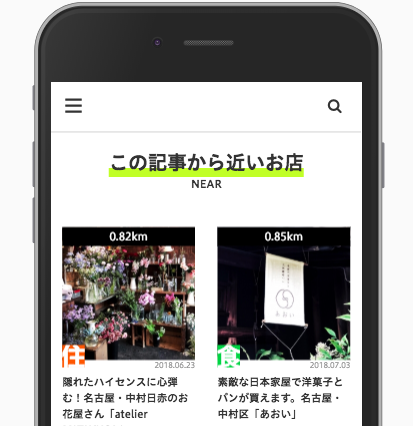
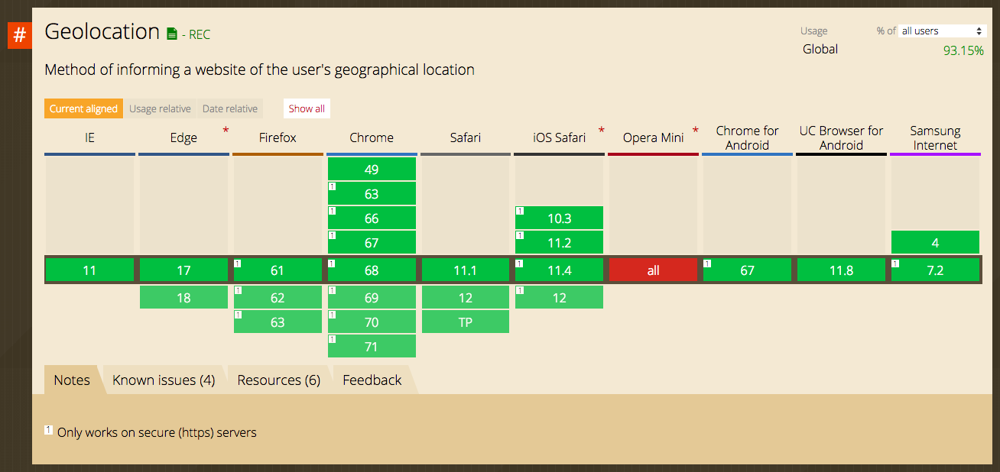

# MySQLの `GEOMETRY` 型とJavaScriptの `Geolocation API` の活用事例

<link rel="https://cdnjs.cloudflare.com/ajax/libs/font-awesome/4.7.0/css/font-awesome.css">
<style>
.qrcode {
  position: fixed;
  bottom: 0;
  right: 0;
  width: 120px;
  height: auto;
}
</style>

---

<div style="background-image:url(./profile.png); position:fixed;top:0;left:0;width:100%;height:100%;"></div>

---
# 目次

1.  位置情報の活用例
2.  技術的説明
3.  今後の課題

---
# 1. 位置情報の活用例


<div style="text-align:center">
  


</div>


### a-blog cms では MySQLの `GEOMETRY` 型を活用していてます。

この機能を活用することで、利用者の位置情報に応じて店舗情報の出し分けが可能になります。

---

## 記事に対して、位置情報を登録



Google Map APIを使用して取得した緯度、経度をエントリー（記事）に紐づけて保存します。


---

この位置情報の機能を活用してできたのが以下のサイト

<div style="text-align: center;">
  


spymaster.jp
</div>

---

<div style="text-align:center;">
  

  
spymaster.jp
</div>

---

## たとえば、


---

## 自分が現在いる地点から近い位置順にお店を表示

<div style="text-align:center">
  

</div>


---

## たとえば、


---


## あるお店から近い位置順にお店を表示

<div style="text-align:center">
  

</div>


---
# 2.  技術的説明


---
## JavaScriptの Geolocation API で現在地を取得

```js
window.navigator.geolocation.getCurrentPosition(
  success, 
  error, 
  options
);
```

*https環境下でないと位置情報を取得できない*

---
## JavaScriptの Geolocation API で現在地を取得

success時

```js
(longitude, latitude) => {
   
});
```

---
## JavaScriptの Geolocation API で現在地を取得



https://caniuse.com/#search=geolo


---
## JavaScriptの Geolocation API で現在地を取得

### デバイスによる挙動の違い
- モバイルは2回聞いたら再び聞いてくる
- PCは一回許可すると許可したまま

---
## フロントから送られてきた位置情報を元にSQL文を発行

MySQL5.7よりGIS機能関連が刷新されGEOMETRY型など位置情報に関するデータを扱いやすくなりました。

```sql
SELECT
 ROUND(
  GLENGTH(
    GEOMFROMTEXT( 
      CONCAT( 'LineString( 130.384369 33.590599 , ', 
        X( geo ) ,  
        ' ', 
        Y( geo ) ,  
        ')'     
      )
  )
 ) * 111000 ) AS distance
```

---
# 今後の課題

Google Mapだけではなく、OpenStreet MapやYahoo Mapにも対応していきたい。

---
# ありがとうございました


